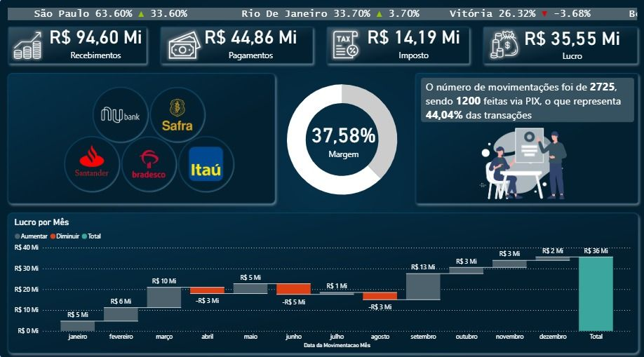
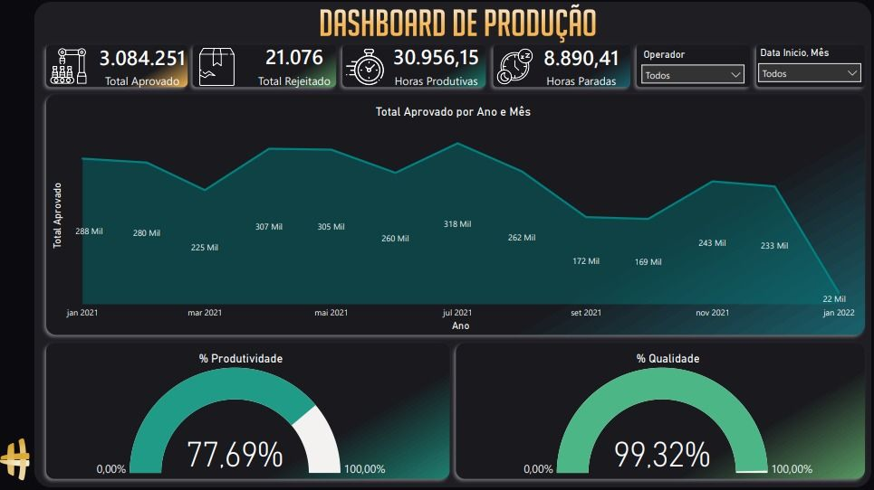
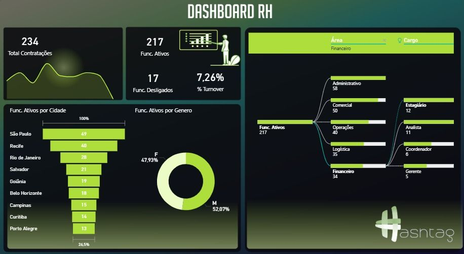

# Dashboards Power BI — Curso Hashtag Treinamentos

Este repositório reúne três projetos desenvolvidos durante o **Intensivão de Power BI** da Hashtag Treinamentos, utilizando diferentes conjuntos de dados para simular cenários de análise nas áreas de Produção, Recursos Humanos e Financeiro (curso com carga horária de 8 horas, concluído em 20/02/25).

## Tecnologias Utilizadas

- Power BI
- Power Query
- DAX
- Modelagem de Dados
- Visualizações Interativas
- Storytelling com Dados

## Competências Demonstradas

- Importação e transformação de dados com Power Query
- Modelagem de dados
- Criação de medidas em DAX
- Desenvolvimento de KPIs
- Construção de dashboards interativos
- Segmentação de dados (filtros e slicers)
- Storytelling com dados
- Uso de diferentes visualizações (cards, gauges, área, funil, rosca, Sankey e waterfall)

## O que aprendi fazendo esses projetos

Durante o desenvolvimento desses dashboards, pratiquei todo o fluxo de criação de soluções analíticas no Power BI, desde a importação, transformação e modelagem dos dados até a construção de indicadores (KPIs) e dashboards interativos. Também explorei diferentes tipos de visualização para comunicar informações de forma clara e apoiar a análise de cenários nas áreas de Produção, Recursos Humanos e Financeiro.

---

## 📊 Dashboard de Produção

Dashboard desenvolvido para monitorar indicadores operacionais de produção, permitindo acompanhar produtividade, qualidade e desempenho ao longo do tempo.

**Principais recursos:**
- KPIs de produção (total aprovado, total rejeitado, horas produtivas e paradas)
- Indicadores de produtividade e qualidade em gauges
- Segmentação por operador
- Segmentação por período
- Gráfico temporal de evolução do total aprovado por ano e mês

---

## 👥 Dashboard de RH

Dashboard desenvolvido para acompanhar indicadores de recursos humanos, como volume de contratações, turnover e distribuição do quadro de funcionários.

**Principais recursos:**
- KPIs de RH (contratações, funcionários ativos/desligados, % turnover)
- Distribuição de funcionários ativos por cidade em gráfico de funil
- Distribuição de funcionários por gênero em gráfico de rosca
- Diagrama Sankey para visualizar o fluxo de funcionários por área e cargo

---

## 💰 Dashboard Financeiro

Dashboard desenvolvido para acompanhar a saúde financeira do negócio, com foco em recebimentos, pagamentos, lucro e margem.

**Principais recursos:**
- KPIs financeiros (recebimentos, pagamentos, imposto e lucro)
- Indicador de margem em gauge
- Análise financeira por região e por instituição bancária
- Gráfico waterfall com a evolução do lucro mês a mês
- Destaque textual dinâmico sobre volume de movimentações e participação do PIX

---

## Certificado

O certificado de conclusão do Intensivão de Power BI da Hashtag Treinamentos está disponível na imagem **[certificado](certificado/)**.
